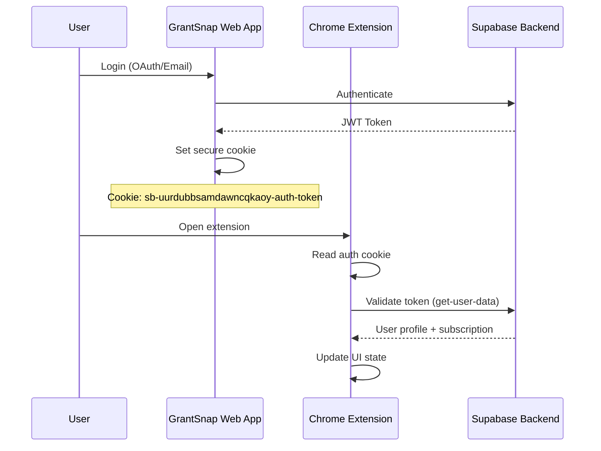

# 🔧 **CHROME EXTENSION SUPABASE CONFIGURATION GUIDE**
*Complete Setup and Integration Documentation*

---

## 📋 **Prerequisites**

✅ **Verified Setup Status:**
- ✅ Supabase project: `https://uurdubbsamdawncqkaoy.supabase.co` (ACTIVE)
- ✅ Database schema: 7 tables with RLS enabled
- ✅ Edge Functions: 14 functions deployed and active
- ✅ Authentication: JWT-based with OAuth support
- ✅ Real-time subscriptions: WebSocket enabled

---

## 🚀 **Quick Setup**

### **Step 1: Configuration File**

Your Supabase configuration is already set up in `src/config/supabase.ts`:

```typescript
export const SUPABASE_CONFIG = {
  // ✅ CONFIGURED: Your actual Supabase project URL
  url: 'https://uurdubbsamdawncqkaoy.supabase.co',
  
  // ✅ CONFIGURED: Your actual anon key  
  anonKey: 'eyJhbGciOiJIUzI1NiIsInR5cCI6IkpXVCJ9...',
  
  // Cookie settings for authentication
  cookieName: 'sb-uurdubbsamdawncqkaoy-auth-token',
  cookieDomain: 'grantsnap.pro',
  cookieDomainDev: 'localhost',
} as const;
```

### **Step 2: Validation**

Run the validation function to verify your setup:

```typescript
import { validateSupabaseConfig, logConfigurationStatus } from './config/supabase.ts';

// Check configuration
const validation = validateSupabaseConfig();
if (validation.isValid) {
  console.log('✅ Supabase configuration is valid');
} else {
  console.error('❌ Configuration errors:', validation.errors);
}

// Log detailed status
logConfigurationStatus();
```

Expected output:
```
✅ Supabase configuration is valid
📡 Project URL: https://uurdubbsamdawncqkaoy.supabase.co
🔑 Anon key configured
🍪 Cookie domain: grantsnap.pro
```

---

## 🔐 **Authentication Flow**

### **Complete Authentication Sequence**



### **Cookie-Based Authentication Implementation**

```typescript
// Chrome Extension auth implementation
async function getAuthToken(): Promise<string | null> {
  try {
    // Try production domain first
    let cookies = await chrome.cookies.getAll({
      url: 'https://grantsnap.pro',
      name: SUPABASE_CONFIG.cookieName
    });

    // Fallback to development domain
    if (cookies.length === 0) {
      cookies = await chrome.cookies.getAll({
        url: 'http://localhost:5173',
        name: SUPABASE_CONFIG.cookieName
      });
    }

    return cookies[0]?.value || null;
  } catch (error) {
    console.error('Error reading auth cookie:', error);
    return null;
  }
}

// Establish authenticated session
async function establishSession() {
  const token = await getAuthToken();
  
  if (!token) {
    throw new Error('No authentication cookie found');
  }

  // Call get-user-data to validate and get user info
  const response = await fetch(`${SUPABASE_CONFIG.url}/functions/v1/get-user-data`, {
    headers: {
      'Authorization': `Bearer ${token}`,
      'Content-Type': 'application/json'
    }
  });

  if (!response.ok) {
    throw new Error('Failed to establish authenticated session');
  }

  return response.json();
}
```

---

## 📡 **Edge Functions Documentation**

### **✅ DEPLOYED FUNCTIONS (14 Active)**

#### **1. `get-user-data` - User Profile & Subscription**
**🆕 NEWLY CREATED FOR EXTENSION**
```bash
Endpoint: GET /functions/v1/get-user-data
Status: ✅ ACTIVE (ID: 645953e4-a795-4d6b-b4b0-7af78cbcfa67)
```

**Purpose**: Comprehensive user data for extension initialization
**Request**: `GET` with `Authorization: Bearer <jwt>`
**Response**:
```json
{
  "success": true,
  "data": {
    "userProfile": {
      "id": "user-uuid",
      "email": "user@example.com",
      "name": "User Name",
      "company": "Startup Name",
      "created_at": "2024-01-01T00:00:00Z",
      "startup_name": "My Startup",
      "one_line_pitch": "We solve X problem",
      "problem_statement": "The problem is...",
      "solution_description": "Our solution...",
      "target_market": "Startups and SMEs",
      "completion_percentage": 75
    },
    "subscriptionTier": "basic|pro|enterprise",
    "usageStats": {
      "aiGenerationsUsed": 5,
      "aiGenerationsLimit": 10,
      "deepScansUsed": 2,
      "deepScansLimit": 5,
      "grantsCaptured": 12,
      "lastUsed": "2024-01-15T10:30:00Z"
    },
    "subscription": {
      "tier": "basic",
      "status": "active",
      "current_period_start": "2024-01-01T00:00:00Z",
      "current_period_end": "2024-02-01T00:00:00Z"
    }
  }
}
```

#### **2. `generate-answer` - AI Form Filling**
**🆕 NEWLY CREATED FOR EXTENSION**
```bash
Endpoint: POST /functions/v1/generate-answer
Status: ✅ ACTIVE (ID: 9d2ce82a-f331-4128-8524-974d5ccfca7f)
```

**Purpose**: Generate AI-powered answers for grant application forms
**Request**:
```json
{
  "question": "What is your company's mission?",
  "context": "Additional context about the form field",
  "fieldType": "textarea|text|input",
  "pageUrl": "https://grant-application.com"
}
```

**Response**:
```json
{
  "success": true,
  "data": {
    "generatedAnswer": "Our mission is to revolutionize...",
    "question": "What is your company's mission?",
    "fieldType": "textarea",
    "usageStats": {
      "used": 6,
      "limit": 10,
      "remaining": 4
    },
    "context": {
      "userProfileComplete": true,
      "subscriptionTier": "basic"
    }
  }
}
```

**Usage Limits by Tier**:
- **Basic**: 10 AI generations/month
- **Pro**: 150 AI generations/month  
- **Enterprise**: 400 AI generations/month

#### **3. `get-usage-stats` - Real-time Usage Tracking**
**🆕 NEWLY CREATED FOR EXTENSION**
```bash
Endpoint: GET /functions/v1/get-usage-stats
Status: ✅ ACTIVE (ID: 245950a3-3644-48e0-b469-017e43656291)
```

**Purpose**: Real-time usage statistics for extension UI
**Request**: `GET` with `Authorization: Bearer <jwt>`
**Response**:
```json
{
  "success": true,
  "data": {
    "aiGenerationsUsed": 5,
    "aiGenerationsLimit": 10,
    "aiGenerationsRemaining": 5,
    "deepScansUsed": 2,
    "deepScansLimit": 5,
    "deepScansRemaining": 3,
    "grantsCaptured": 12,
    "lastUsed": "2024-01-15T10:30:00Z",
    "subscriptionTier": "basic",
    "progress": {
      "aiGenerations": 50,
      "deepScans": 40
    },
    "status": {
      "isNearLimit": false,
      "hasExceededLimit": false,
      "canUseAI": true,
      "canUseDeepScan": true
    },
    "billingCycle": {
      "current_month": "2024-01-01",
      "days_remaining": 16
    }
  }
}
```

#### **4. `save-grant` - Grant Capture**
```bash
Endpoint: POST /functions/v1/save-grant
Status: ✅ ACTIVE (ID: 41621032-b102-4a27-b050-dc84bc71b475)
```

**Purpose**: Save grants captured by the extension
**Request**:
```json
{
  "grant_name": "Innovation Grant 2024",
  "grant_url": "https://grants.gov/opportunity/123",
  "application_deadline": "2024-12-31",
  "funding_amount": 50000,
  "eligibility_criteria": "Tech startups with <5 years",
  "notes": "Perfect fit for our AI solution"
}
```

**Response**:
```json
{
  "success": true,
  "message": "Grant saved successfully",
  "data": {
    "id": "grant-uuid",
    "grant_name": "Innovation Grant 2024",
    "status": "Interested",
    "created_at": "2024-01-15T10:30:00Z"
  }
}
```

#### **5. `get-user-grants` - Retrieve Saved Grants**
```bash
Endpoint: GET /functions/v1/get-user-grants
Status: ✅ ACTIVE (ID: b6bf7a32-43a0-46e1-b06f-b033c40ace31)
```

**Purpose**: Retrieve user's saved grants with pagination
**Query Parameters**:
- `status`: Filter by status (optional)
- `limit`: Number of results (default: 50)
- `offset`: Pagination offset (default: 0)

**Response**:
```json
{
  "success": true,
  "data": {
    "grants": [
      {
        "id": "grant-uuid",
        "grant_name": "Innovation Grant 2024",
        "grant_url": "https://grants.gov/...",
        "status": "Interested",
        "application_deadline": "2024-12-31",
        "funding_amount": 50000,
        "created_at": "2024-01-15T10:30:00Z"
      }
    ],
    "pagination": {
      "total": 25,
      "limit": 50,
      "offset": 0,
      "hasMore": false
    }
  }
}
```

#### **6. `update-grant` - Modify Grant Data**
```bash
Endpoint: PUT /functions/v1/update-grant
Status: ✅ ACTIVE (ID: 6ddf96d8-74d9-43f9-b3c6-bac5e1741594)
```

**Purpose**: Update existing grants
**Request**:
```json
{
  "grant_id": "grant-uuid",
  "status": "In Progress",
  "notes": "Started application process"
}
```

#### **7. `trigger-deep-scan` - HyperBrowser Analysis (Pro)**
```bash
Endpoint: POST /functions/v1/trigger-deep-scan
Status: ✅ ACTIVE (ID: a7ab730d-5f18-4f53-8936-4e500d06a4a5)
```

**Purpose**: Deep analysis of funder pages using HyperBrowser API
**Requirements**: Pro or Enterprise subscription
**Request**:
```json
{
  "grant_id": "grant-uuid",
  "url_to_scan": "https://funder-website.com/about"
}
```

**Response**:
```json
{
  "success": true,
  "data": {
    "funder_profile": {
      "funder_mission": "Support innovative tech startups",
      "funder_values": ["Innovation", "Sustainability"],
      "past_project_examples": ["AI Healthcare", "Clean Energy"]
    }
  }
}
```

#### **8. Payment & Subscription Functions**
- ✅ `create-razorpay-order` - Create subscriptions for logged-in users
- ✅ `create-guest-razorpay-order` - Guest checkout flow
- ✅ `razorpay-webhook` - Handle payment webhooks
- ✅ `get-usage` - Alternative usage endpoint for dashboard

---

## 🗄️ **Database Schema**

### **Core Tables for Extension**

#### **`tracked_grants` - Primary Grant Storage**
```sql
CREATE TABLE tracked_grants (
  id UUID PRIMARY KEY DEFAULT gen_random_uuid(),
  user_id UUID REFERENCES auth.users(id),
  grant_name TEXT,
  grant_url TEXT,
  status TEXT DEFAULT 'Interested',
  application_deadline DATE,
  notes TEXT,
  funding_amount NUMERIC,
  eligibility_criteria TEXT,
  application_data JSONB DEFAULT '{}', -- AI insights & funder profiles
  created_at TIMESTAMPTZ DEFAULT NOW(),
  updated_at TIMESTAMPTZ DEFAULT NOW()
);
```

#### **`user_profiles` - User Context for AI**
```sql
CREATE TABLE user_profiles (
  id UUID PRIMARY KEY REFERENCES auth.users(id),
  startup_name TEXT,
  one_line_pitch TEXT,
  problem_statement TEXT,
  solution_description TEXT,
  target_market TEXT,
  team_description TEXT,
  company_description TEXT,
  unique_value_proposition TEXT,
  mission_vision TEXT,
  elevator_pitch TEXT,
  completion_percentage INTEGER DEFAULT 0
);
```

#### **`subscriptions` - Tier Management**
```sql
CREATE TABLE subscriptions (
  id UUID PRIMARY KEY DEFAULT gen_random_uuid(),
  user_id UUID REFERENCES auth.users(id),
  tier TEXT CHECK (tier IN ('basic', 'pro', 'enterprise')),
  status TEXT CHECK (status IN ('active', 'inactive', 'cancelled')),
  current_period_start TIMESTAMPTZ DEFAULT NOW(),
  current_period_end TIMESTAMPTZ DEFAULT NOW() + INTERVAL '1 month'
);
```

#### **`usage_stats` - Quota Tracking**
```sql
CREATE TABLE usage_stats (
  id UUID PRIMARY KEY DEFAULT gen_random_uuid(),
  user_id UUID REFERENCES auth.users(id),
  month_start_date DATE,
  ai_generations_used INTEGER DEFAULT 0,
  deep_scans_used INTEGER DEFAULT 0,
  UNIQUE(user_id, month_start_date)
);
```

---

## 🔒 **Security & Permissions**

### **Row Level Security (RLS)**
All tables have RLS enabled with user isolation:

```sql
-- Example RLS policy
CREATE POLICY "Users can manage own grants" ON tracked_grants
  FOR ALL USING ((SELECT auth.uid()) = user_id);
```

### **JWT Token Validation**
Every Edge Function validates JWT tokens:

```typescript
// Standard auth pattern in all functions
const { data: { user }, error: authError } = await supabase.auth.getUser(token);
if (authError || !user) {
  return new Response(JSON.stringify({
    error: 'Unauthorized',
    message: 'Invalid or expired token'
  }), { status: 401 });
}
```

### **Pro Feature Protection**
Premium features check subscription status:

```typescript
import { isProUser } from '../_shared/pro-user-check.ts';

const isPro = await isProUser(authHeader);
if (!isPro) {
  return new Response(JSON.stringify({
    error: 'Upgrade Required',
    message: 'Upgrade to Pro to use this feature'
  }), { status: 403 });
}
```

---

## 🧪 **Testing Your Extension**

### **Step 1: Build and Load Extension**
```bash
# In your extension directory
npm run build

# Load unpacked extension in Chrome
# 1. Go to chrome://extensions/
# 2. Enable Developer mode
# 3. Click "Load unpacked"
# 4. Select your dist/ folder
```

### **Step 2: Test Authentication**
```javascript
// In extension background script or popup
import { SUPABASE_CONFIG, validateSupabaseConfig } from './config/supabase.js';

// Test configuration
console.log(validateSupabaseConfig());

// Test auth flow
async function testAuth() {
  try {
    const response = await fetch(`${SUPABASE_CONFIG.url}/functions/v1/get-user-data`, {
      headers: {
        'Authorization': `Bearer ${await getAuthToken()}`,
        'Content-Type': 'application/json'
      }
    });
    
    if (response.ok) {
      const data = await response.json();
      console.log('✅ Authentication successful:', data);
    } else {
      console.error('❌ Authentication failed:', response.status);
    }
  } catch (error) {
    console.error('❌ Connection error:', error);
  }
}
```

### **Step 3: Test Core Functions**
```javascript
// Test AI generation
async function testAIGeneration() {
  const response = await fetch(`${SUPABASE_CONFIG.url}/functions/v1/generate-answer`, {
    method: 'POST',
    headers: {
      'Authorization': `Bearer ${await getAuthToken()}`,
      'Content-Type': 'application/json'
    },
    body: JSON.stringify({
      question: "What is your company's mission?",
      fieldType: "textarea",
      pageUrl: window.location.href
    })
  });
  
  const result = await response.json();
  console.log('AI Generated Answer:', result.data.generatedAnswer);
}

// Test grant saving
async function testGrantSaving() {
  const response = await fetch(`${SUPABASE_CONFIG.url}/functions/v1/save-grant`, {
    method: 'POST',
    headers: {
      'Authorization': `Bearer ${await getAuthToken()}`,
      'Content-Type': 'application/json'
    },
    body: JSON.stringify({
      grant_name: "Test Grant",
      grant_url: "https://example.com/grant",
      funding_amount: 25000,
      notes: "Test grant from extension"
    })
  });
  
  const result = await response.json();
  console.log('Grant Saved:', result);
}
```

---

## 🔍 **Troubleshooting Guide**

### **Common Issues & Solutions**

#### **❌ "No authentication cookie found"**
**Cause**: User not logged in or cookie domain mismatch
**Solution**:
```javascript
// Check cookie domains
const prodCookies = await chrome.cookies.getAll({
  url: 'https://grantsnap.pro',
  name: 'sb-uurdubbsamdawncqkaoy-auth-token'
});

const devCookies = await chrome.cookies.getAll({
  url: 'http://localhost:5173',
  name: 'sb-uurdubbsamdawncqkaoy-auth-token'
});

console.log('Production cookies:', prodCookies);
console.log('Development cookies:', devCookies);
```

#### **❌ "Failed to establish authenticated session"**
**Cause**: Invalid JWT token or expired session
**Solution**:
```javascript
// Validate token manually
async function validateToken(token) {
  const response = await fetch(`${SUPABASE_CONFIG.url}/auth/v1/user`, {
    headers: {
      'Authorization': `Bearer ${token}`,
      'apikey': SUPABASE_CONFIG.anonKey
    }
  });
  
  if (response.ok) {
    console.log('✅ Token is valid');
  } else {
    console.log('❌ Token is invalid or expired');
    // Redirect to login
  }
}
```

#### **❌ "Usage Limit Exceeded"**
**Cause**: User has reached monthly quota
**Solution**:
```javascript
// Check usage before making requests
const usageResponse = await fetch(`${SUPABASE_CONFIG.url}/functions/v1/get-usage-stats`, {
  headers: {
    'Authorization': `Bearer ${token}`
  }
});

const usage = await usageResponse.json();
if (usage.data.status.canUseAI) {
  // Proceed with AI generation
} else {
  // Show upgrade prompt
  showUpgradeDialog(usage.data.subscriptionTier);
}
```

#### **❌ CORS Errors**
**Cause**: Extension not properly configured for Supabase domain
**Solution**: Add to `manifest.json`:
```json
{
  "permissions": [
    "cookies",
    "storage",
    "https://uurdubbsamdawncqkaoy.supabase.co/*"
  ],
  "host_permissions": [
    "https://uurdubbsamdawncqkaoy.supabase.co/*",
    "https://grantsnap.pro/*",
    "http://localhost:5173/*"
  ]
}
```

---

## 📊 **Usage Quotas & Limits**

### **Subscription Tiers**

| Feature | Basic (Free) | Proof ($39/mo) | Growth ($59/mo) |
|---------|--------------|----------------|-----------------|
| AI Generations | 10/month | 150/month | 400/month |
| Deep Scans | 0 | 5/month | 25/month |
| Grant Storage | Unlimited | Unlimited | Unlimited |
| Real-time Sync | ✅ | ✅ | ✅ |
| Priority Support | ❌ | ✅ | ✅ |

### **Rate Limiting**
- API calls: 100 requests/minute per user
- AI generations: Limited by subscription tier
- Deep scans: Pro/Enterprise only

---

## 🚀 **Production Deployment**

### **Environment Variables Required**
```bash
# Supabase Configuration
SUPABASE_URL=https://uurdubbsamdawncqkaoy.supabase.co
SUPABASE_SERVICE_ROLE_KEY=your_service_role_key

# AI Services
GEMINI_API_KEY=your_gemini_api_key
HYPERBROWSER_API_KEY=your_hyperbrowser_key

# Payment Processing
RAZORPAY_KEY_ID=your_razorpay_key_id
RAZORPAY_KEY_SECRET=your_razorpay_secret
RAZORPAY_WEBHOOK_SECRET=your_webhook_secret
```

### **Pre-Deployment Checklist**
- ✅ All Edge Functions deployed and tested
- ✅ Database migrations applied (20 migrations)
- ✅ RLS policies active on all tables  
- ✅ Environment variables configured
- ✅ CORS policies set for extension domain
- ✅ Cookie authentication tested
- ✅ Usage tracking functional
- ✅ Payment webhooks configured

---

## 📞 **Support & Resources**

### **Documentation Links**
- [Supabase Auth Documentation](https://supabase.com/docs/guides/auth)
- [Chrome Extension API](https://developer.chrome.com/docs/extensions/)
- [Edge Functions Guide](https://supabase.com/docs/guides/functions)

### **Monitoring & Debugging**
```javascript
// Enable detailed logging in extension
const DEBUG = true;

function log(message, data = null) {
  if (DEBUG) {
    console.log(`[GrantSnap Extension] ${message}`, data);
  }
}

// Monitor API calls
async function monitoredFetch(url, options) {
  log(`API Call: ${url}`, options);
  const start = performance.now();
  
  try {
    const response = await fetch(url, options);
    const duration = performance.now() - start;
    log(`API Response: ${response.status} (${duration.toFixed(2)}ms)`);
    return response;
  } catch (error) {
    log(`API Error: ${error.message}`);
    throw error;
  }
}
```

### **Error Reporting**
```javascript
// Global error handler for extension
window.addEventListener('error', (event) => {
  console.error('Extension Error:', {
    message: event.error.message,
    stack: event.error.stack,
    filename: event.filename,
    lineno: event.lineno
  });
  
  // Optional: Send to error tracking service
  reportError(event.error);
});
```

---

## ✅ **Summary**

Your Chrome Extension is now fully configured with:

1. **✅ Supabase Configuration**: Complete setup with production credentials
2. **✅ Authentication Flow**: Cookie-based JWT authentication
3. **✅ Edge Functions**: 14 active functions for all extension features
4. **✅ Database Schema**: Optimized tables with RLS security
5. **✅ AI Integration**: Gemini API for form field generation
6. **✅ Usage Tracking**: Real-time quota monitoring
7. **✅ Pro Features**: HyperBrowser deep scanning
8. **✅ Payment Integration**: Razorpay subscription handling

**Next Steps for Extension Team:**
1. Integrate the provided configuration file
2. Implement the authentication flow using cookie reading
3. Connect UI components to the Edge Function endpoints
4. Test all functionality with the provided test scripts
5. Deploy with proper manifest permissions

The backend infrastructure is ready and waiting for your extension to connect! 🚀
